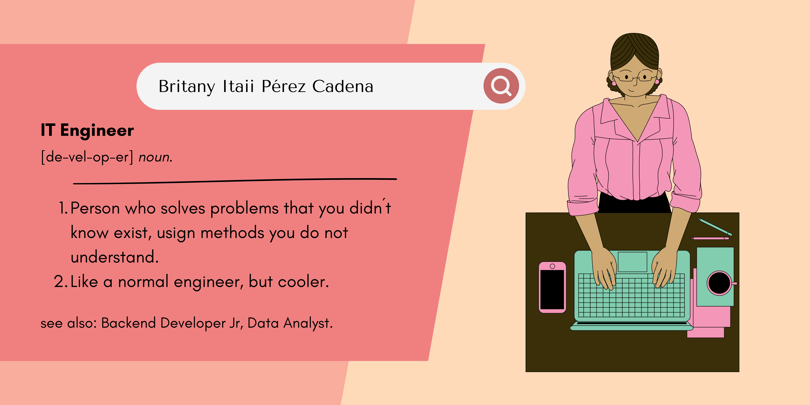
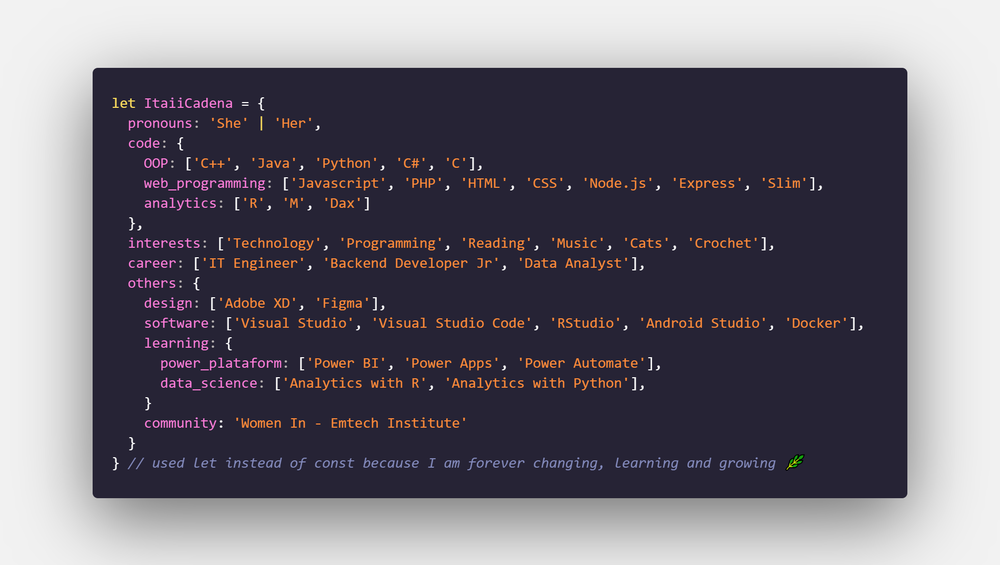

    <h2 align='center'>
        Hello there, welcome to my GitHub. I'm Itaii
    </h2>
    

    
 Where to find me: 

    
     
    

    

        
    

    

        

            
        

        

            
        

    

